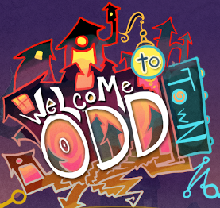
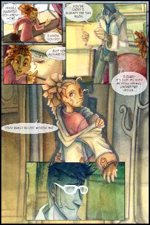

# Oddtown

ActionScript source code for an interactive, audiovisual, animated comic game.

Code is provided for historical/educational purposes only - the last revision was made in 05/2013.

## About

Welcome to Odd Town was a game created in 2013 and presented during the 2013 IUPUI Media Arts & Sciences Capstones. WtOT highlights Bekah Crowmer's multimedia artwork, writing and the Odd Town universe and explores how a passive comic viewing experience can be augmented with interactive elements. Concept, story and all artwork/illustration by [Bekah Crowmer](https://www.instagram.com/mushmuse/). Animation and menu development by [Brat Kelley](https://www.instagram.com/FeyKnights). Programming and sound design by [Dean Verleger](https://github.com/deanbot).

## Gameplay

As a comic-viewer, WtOT used a viewport which moves automatically within a top down, 2D, space to show or highlight different locations on a comic page. The comic page is scaled in and out to give the illusion of a 3rd dimension or "zooming". Generally, panels are hidden or faded-out until the viewport moves to them; at which point they are reavealed and any animations in the panel are triggered. A panel animation might include speech bubble reveals, panning, simple animation of subjects, or complex frame-by-frame-animation sequences. After completing a page the user can zoom into any part of the page to get another view before changing pages. 

In addition to linear, animation-driven progression, some panels allow point-and-click exploration, minigames, or require completion of puzzles before the user can progress. The player unlocks alternate panels depending on their actions. 

WtOT is fully scored with loopable music and ambient sound tracks which can stay consistent, change levels, or transition in or out when progressing between pages or panels (i.e. moving to the "grandfather clock" panel increases the "clock noises" sound channel's volume). One-off sound effects can trigger within a panel or during user interaction.

## Play it!

Play (with Flash Player) at [oddtown.dreamfed.net](https://oddtown.dreamfed.net).